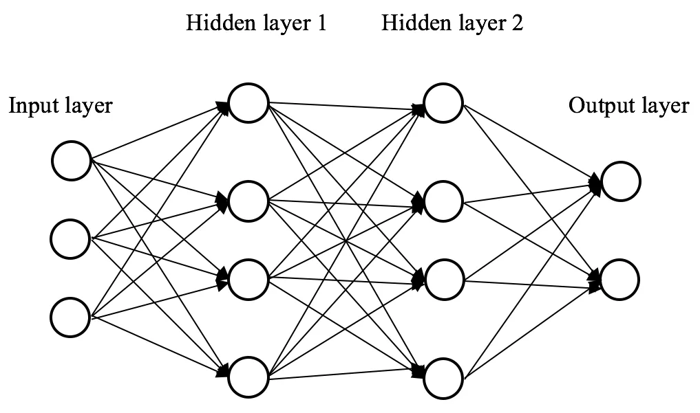
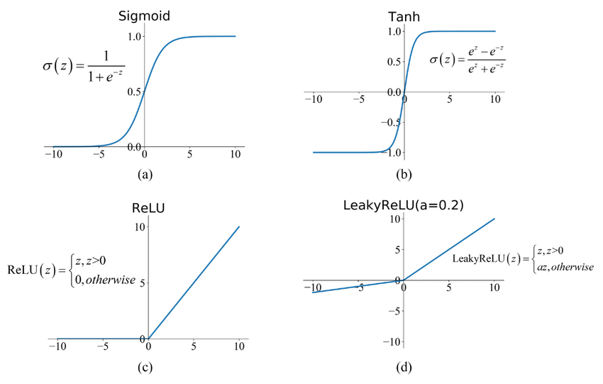
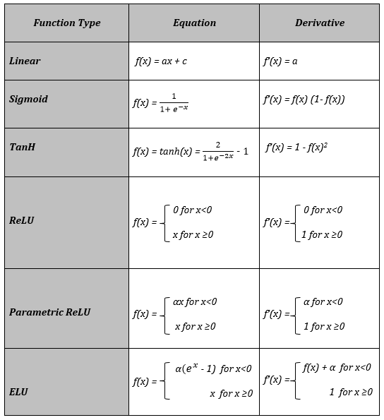

# Neural Network Math

# Forward Propagation

To begin with, let’s create a simple 3 layer Neural Network. The first 2 layers will use the ReLU activation function, and because this is a classification task, we will use the sigmoid activation function in the output layer.

$$
Z1 = W1 \cdot X + b1
$$

$$
A1 = ReLU(Z1)
$$

$$
Z2 = W2 \cdot A1 + b2
$$

$$
A2 = ReLU(Z2)
$$

$$
Z3 = W3 \cdot A2 + b3
$$

$$
A3 = \sigma(Z3)
$$

Where:

- $A(l)$ is the activation vector for layer $l$
- $Z(l)$ is the weighted sum of inputs of layer $l$
- $W(l)$ is the matrix of weights for the connections between layer $l-1$ and $l$
- $b(l)$ is the bias vector for layer $l$
- $ReLU$ is the activation function. These can be replaced by any of the other activation functions.
- $\sigma$ is the sigmoid activation function:

$$
\sigma(z) = \frac{1}{1+e^{-z}}
$$

# Backward Propagation

## Classification

### Loss Function

The loss function helps us understand the quality of the model’s predictions. The loss refers to the error of a single observation, while the cost refers to the average error of the entire dataset. For classification tasks, we can use **Binary Cross Entropy** which is:

$$
J(x, y)= -\frac{1}{m} \sum_{i=1}^m(y^{(i)}ln(h_\sigma(x^{(i)})))+(1-y^{(i)})ln(1-(\sigma(x^{(i)})))
$$

Where:

- $J$ is the **cost function**
- $\sigma$ represents the **hypothesis function**, which in this case is the sigmoid function. The hypothesis function is a function that produces the predicted output of the network.

In the Binary Cross Entropy function, $\sigma(x)$ is the probability that the input belongs to the positive class. $1 - \sigma(x)$ is the probability that the input belongs to the negative class.

Treating A3 and y as matrices inputted in the function, we can get rid of the summation:

$$
J(A3, y) = -\frac{1}{m}(y\cdot ln(A3)+(1-y)\cdot ln(1-A3))
$$

Where:

- $A3$ is the predicted value of a sample
- $y$ is the actual value of a sample

The process of backpropagation involves taking the derivatives from the loss function with respect to the weights and biases.

First, we have to take the derivative of the loss function with respect to the last layer’s parameter because we are going **backwards** through the network. In this case that is $W3$. However, $W3$ is not in the loss function, but is in another **chained** function: $Z3$. To derive this, we need to start from the loss function and take the partial derivate using the chain rule starting from the loss function, then $A3$, and finally $Z3$. We use the chain rule as this allows us to understand how much the weights and activations affect the final cost function. This can be represented as:

$$
\frac{\partial J}{\partial W3} = \frac{\partial J}{\partial A3} \cdot \frac{\partial A3}{\partial Z3} \cdot \frac{\partial Z3}{\partial W3}
$$

### Derivative of the Loss Function

The derivative of the Binary Cross Entropy loss function is: (Remember that the derivative of $ln(x)$ is $\frac{1}{x}$. We have to remember to divide by the number of samples.

$$
\frac{1}{m} (\frac{-y}{A3}+\frac{1-y}{1-A3})=\frac{1}{m}(\frac{A3-yA3-y+yA3}{A3(1-A3)})=\frac{1}{m}(\frac{A3-y}{A3(1-A3)})
$$

In the above, we have to remember that the value of $A3_i$ is the output of the sigmoid function. The derivative of the sigmoid function is defined as:

$$
\sigma \prime = \sigma(z)\cdot (1-\sigma(z))
$$

Where the sigmoid function is:

$$
\sigma(z)=\frac{1}{1+e^{-z}}
$$

Looking at the derivative of the sigmoid function on a graph, it looks very similar to a Gaussian curve with a curve upwards in the middle. This aligns with what we would expect for the rate of change of the sigmoid function.

### Finding Partial Derivatives

We can replace $\sigma(z)$ with $A3$ as that is the final activation anyways. Now, we have to find the derivative of $Z3$ with respect to $W3$.

Since $Z3 = W3 \cdot A2 + b3$, this can be viewed as a linear line, so the derivative must be the slope of the line: $A2$

Thus, putting each of the partial derivatives together, we get that the derivative of the Binary Cross Entropy Loss function with respect to $W3$ is:

$$
\frac{\partial J}{\partial W3}=\frac{1}{m} \cdot \frac{A3_i-y_i}{A3_i(1-A3_i)}\cdot A3_i(1 - A3_i) \cdot A2
$$

Simplifying this, we get:

$$
\partial W3 = \frac{A2}{m}(A3-y)
$$

We can get rid of the last part of the chained expression, which is equal to $A2$ to get:

$$
\partial Z3 = \frac{1}{m}(A3-y)
$$

We need to get this partial derivative as it is needed to calculate the gradients as we go backwards through the network.

The partial derivative of a sum is the derivative of a function with respect to one of its variables while treating other variables as constants, disregarding them in differentiation. The term $b3$ would be constant, while the derivative of $Z3$ with respect to $W3$ would be the partial derivate that we are looking for.

We can further use the chain rule to find the derivative of the loss with respect to $W2$:

$$
\frac{\partial J}{\partial W2} = \frac{\partial J}{\partial A3} \cdot \frac{\partial A3}{\partial Z3} \cdot \frac{\partial Z3}{\partial A2} \cdot \frac{\partial A2}{\partial Z2} \cdot \frac{\partial Z2}{\partial W2}
$$

The derivative of $\frac{\partial Z3}{\partial A2}$ is calculated similarly to above:

$$
Z3=W3 \cdot A2 + b3
$$

So the derivative term is equal to $W3$

We also have to find the derivative of the Activation Function used in the second layer, $\frac{\partial A2}{\partial Z2}$, which we can just represent as $g\prime(Z2)$ for now. Depending on the activation function being used, the derivative is different.

Also, the derivative of $\frac{\partial Z2}{\partial W2}$ is $A1$, since:

$$
Z2=W2 \cdot A1 + b2
$$

Putting each of these partial derivatives through the chained equation above, we get that $\partial W2 = \partial Z3 \cdot W3 \cdot g\prime(Z2) \cdot A1$

Plugging in the known value of $\partial Z3$, we get that $\partial W2$ is:

$$
\partial W2 = \frac{1}{m}(A3 - y) \cdot W3 \cdot g\prime(Z2) \cdot A1
$$

Removing the last term of the chained expression, $A1$, we get that:

$$
\partial Z2 = \partial Z3 \cdot W3 \cdot g\prime(Z2)
$$

Plugging in the known value of $\partial Z3$, we get that the gradient of $\partial Z2$ is:

$$
\partial Z2 = \frac{1}{m}(A3-y) \cdot W3 \cdot g\prime(Z2)
$$

Following the same steps to calculate the derivative of $W1$, we get the chained expression:

$$
\frac{\partial J}{\partial W2} = \frac{\partial J}{\partial A3} \cdot \frac{\partial A3}{\partial Z3} \cdot \frac{\partial Z3}{\partial A2} \cdot \frac{\partial A2}{\partial Z2} \cdot \frac{\partial Z2}{\partial A1} \cdot \frac{\partial A1}{\partial Z1} \cdot \frac{\partial Z1}{\partial W1}
$$

Using the previously calculated expressions, we get that the derivative of $\frac{\partial Z1}{\partial W1}$ is $X$ (our input), which makes sense. We get this since, $Z1 = (W1 \cdot X) + b1$

Putting these through the chained equation, we get that $\partial W1 = \partial Z2 \cdot W2 \cdot g\prime(Z1) \cdot X$

Substituting the known value for $\partial Z2$, we get:

$$
\partial W1 = (\frac{1}{m}(A3-y) \cdot W3 \cdot g\prime(Z2)) \cdot W2 \cdot g\prime(Z1) \cdot X
$$

Removing the last term of the chained expression, $X$, we get that:

$$
\partial Z1 = \partial Z2 \cdot W2 \cdot g\prime(Z1)
$$

Substituting the known value for $\partial Z2$, we get:

$$
\partial Z1 = (\frac{1}{m}(A3-y) \cdot W3 \cdot g\prime(Z2)) \cdot W2 \cdot g\prime(Z1)
$$

Looking back at this, we use the chain rule of partial derivatives because we are trying to find the derivative of $W3$ with respect to the loss function, but the loss function does not actually contain $W3$. So we use the chain rule to use the equation for $Z3$.

We need to save the variables for $\partial Z1$, $\partial Z2$, and $\partial Z3$ because we need these to calculate the bias term. We can just sum up all of the terms in each of these partial derivatives as they have already been divided by the size of the data samples to get the bias term for each.

## Regression

### Loss Function

The loss function helps us understand the quality of the model’s predictions. The loss refers to the error of a single observation, while the cost refers to the average error of the entire dataset. For regression tasks, we can use **Mean Squared Error** which is:

$$
J(A3, y) = \frac{1}{m} \sum_{i=1}^m (A3_{i} - y_i)^2
$$

Where:

- $J$ is the **cost function**

We can get rid of the summation by treating $A3$ and $y$ as matrices:

$$
J(A3, y) = \frac{1}{m}(A3 - y)^2
$$

The process of backpropagation involves taking the derivatives from the loss function with respect to the weights and biases.

We can follow a similar process to above. However in this case, $A3 = Z3$ since we are using a linear activation, so the chained expression becomes:

$$
\frac{\partial J}{\partial W3} = \frac{\partial J}{\partial Z3} \cdot \frac{\partial Z3}{\partial W3}
$$

### Derivative of the Loss Function

The derivative of the Mean Squared Error loss function with respect to $A_3$ can be easily calculated using the power rule, which is:

$$
\frac{2}{m}(A3-y)
$$

### Finding Partial Derivatives

Now that we know the derivative of the loss function in terms of $A3$ (which is equal to $Z_3$), we have to find the derivative of $Z3$ with respect to $W3$.

Since $Z3_i = W3 \cdot A2_i + b3$, this can be viewed as a linear line, so the derivative must be the slope of the line: $A2$

Thus, putting each of the partial derivatives together, we get that the derivative of the MSE Loss function with respect to $W3$ is:

$$
\frac{\partial J}{\partial W3}=\frac{2}{m}(A3 - y)\cdot A2
$$

We can get rid of the last part of the chained expression, $A2$ to get:

$$
\partial Z3 = \frac{2}{m}(A3-y)
$$

The partial derivative of a sum is the derivative of a function with respect to one of its variables while treating other variables as constants, disregarding them in differentiation. The term $b3$ would be constant, while the derivative of $Z3$ with respect to $W3$ would be the partial derivate that we are looking for.

We can further use the chain rule to find the derivative of the loss with respect to $W2$:

$$
\frac{\partial J}{\partial W2} = \frac{\partial J}{\partial Z3}  \cdot \frac{\partial Z3}{\partial A2} \cdot \frac{\partial A2}{\partial Z2} \cdot \frac{\partial Z2}{\partial W2}
$$

The derivative of $\frac{\partial Z3}{\partial A2}$ is calculated similarly to above:

$$
Z3=W3 \cdot A2 + b3
$$

So the derivative term is equal to $W3$

We also have to find the derivative of the Activation Function used in the second layer, $\frac{\partial A2}{\partial Z2}$, which we can just represent as $g\prime(Z2)$ for now. Depending on the activation function being used, the derivative is different.

Also, the derivative of $\frac{\partial Z2}{\partial W2}$ is $A1$, since:

$$
Z2=W2 \cdot A1 + b2
$$

Putting each of these partial derivatives through the chained equation above, we get that $\partial W2 = \partial Z3 \cdot W3 \cdot g\prime(Z2) \cdot A1$

Plugging in the known value of $\partial Z3$, we get that $\partial W2$ is:

$$
\partial W2 = \frac{2}{m}(A3-y) \cdot W3 \cdot g\prime(Z2) \cdot A1
$$

Removing the last term of the chained expression, $A1$, we get that:

$$
\partial Z2 = \partial Z3 \cdot W3 \cdot g\prime(Z2)
$$

Plugging in the known value of $\partial Z3$, we get:

$$
\partial Z2 = \frac{2}{m}(A3-y) \cdot W3 \cdot g\prime(Z2)
$$

Following the same steps to calculate the derivative of $W1$, we get the chained expression:

$$
\frac{\partial J}{\partial W2} =  \frac{\partial J}{\partial Z3}  \cdot \frac{\partial Z3}{\partial A2} \cdot \frac{\partial A2}{\partial Z2}  \cdot \frac{\partial Z2}{\partial A1} \cdot \frac{\partial A1}{\partial Z1} \cdot \frac{\partial Z1}{\partial W1}
$$

Using the previously calculated expressions, we get that the derivative of $\frac{\partial Z1}{\partial W1}$ is $X$ (our input), which makes sense. We get this since, $Z1 = (W1 \cdot X) + b1$

Putting these through the chained equation, we get that $\partial W1 = \partial Z2 \cdot W2 \cdot g\prime(Z1) \cdot X$

Plugging in the known value of $\partial Z2$, we get:

$$
\partial W1 = (\frac{2}{m}(A3-y) \cdot W3 \cdot g\prime(Z2)) \cdot W2 \cdot g\prime(Z1) \cdot X
$$

Removing the last term of the chained expression, $X$, we get that:

$$
\partial Z1 = \partial Z2 \cdot W2 \cdot g\prime(Z1)
$$

Plugging in the known value of $\partial Z2$, we get:

$$
\partial Z1 = (\frac{2}{m}(A3-y) \cdot W3 \cdot g\prime(Z2)) \cdot W2 \cdot g\prime(Z1)
$$

Looking back at this, we use the chain rule of partial derivatives because we are trying to find the derivative of $W3$ with respect to the loss function, but the loss function does not actually contain $W3$. So we use the chain rule to use the equation for $Z3$.

We need to save the variables for $\partial Z1$, $\partial Z2$, and $\partial Z3$ because we need these to calculate the bias term. We can just sum up all of the terms in each of these partial derivatives as they have already been divided by the size of the data samples to get the bias term for each.

## Gradient Descent

Now that we have the partial derivatives of the weights and biases for each layer, we actually have to use these. This is where the process of gradient descent comes into play. Gradient Descent is an iterative process in which we take the calculated gradients for the weights and biases, and subtract them from the respective weight or bias with a learning rate, $\alpha$.

$$
W_i=W_{i-1}-(\alpha \cdot \frac{\partial J}{\partial  W_i})
$$

$$
b_i=b_{i-1}-(\alpha \cdot \sum_{j=1}^m \partial ZI_j)
$$

This allows us to find the metaphorical “valley” or dips in the cost function in which the loss has been minimized, which is the goal of our training model.
